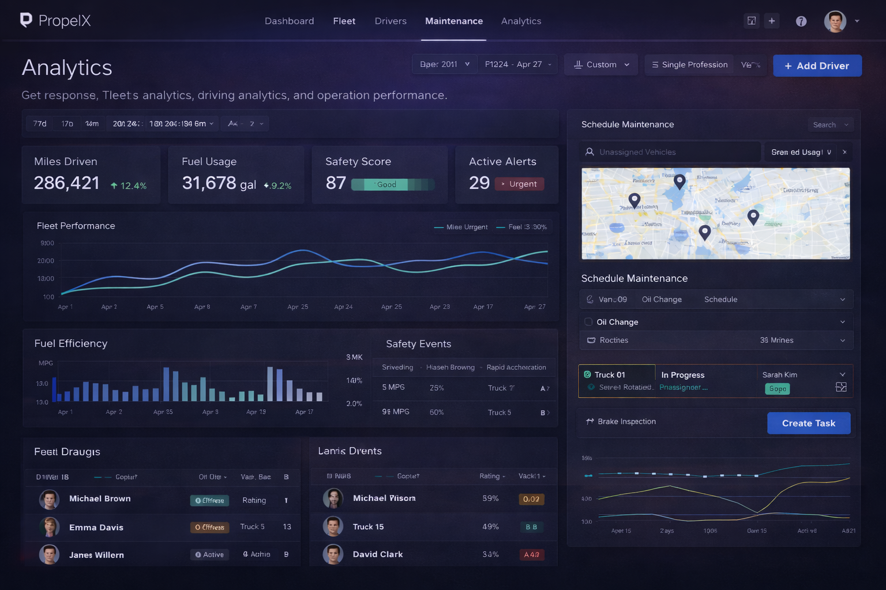
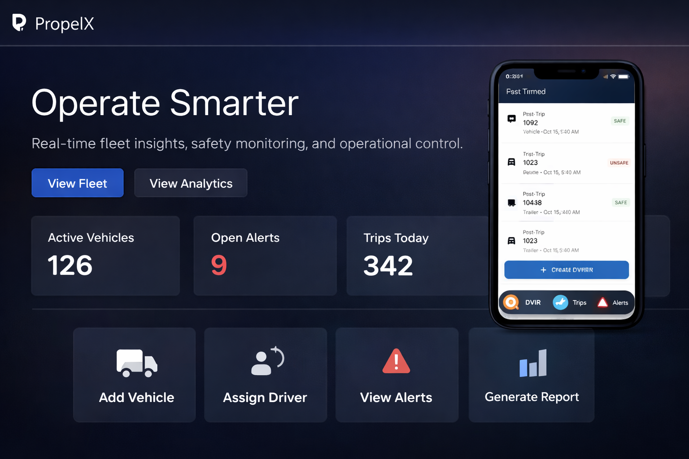
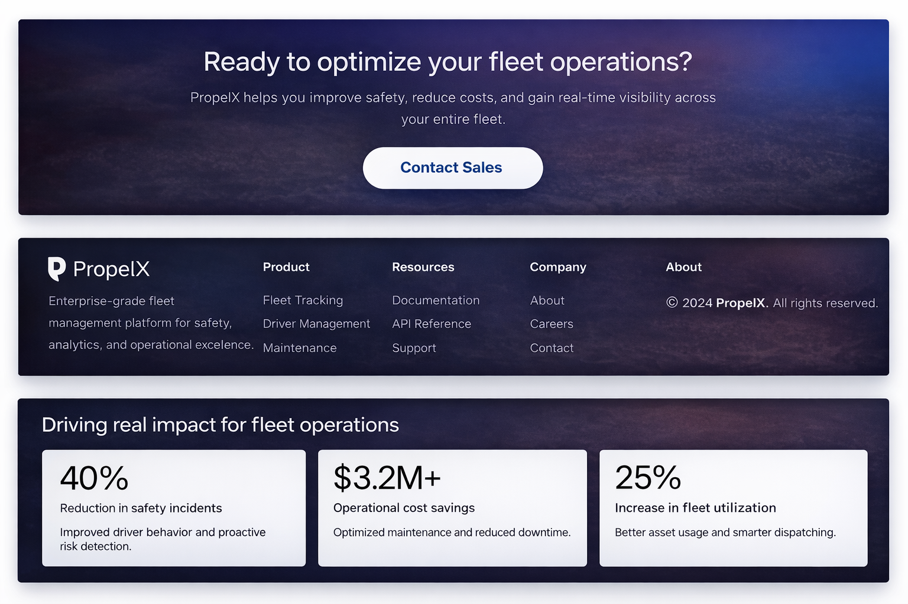

🚚 PropelX — Enterprise Fleet Management Platform 

PropelX is a full-stack, enterprise-grade fleet management and analytics platform designed to help organizations improve safety, reduce operational costs, and gain real-time visibility across their vehicle fleet.

The platform provides real-time tracking, advanced analytics, role-based access control, and automated maintenance workflows — enabling fleet operators to make data-driven decisions at scale.

Built with modern, production-ready technologies, PropelX demonstrates best practices in scalability, performance, and maintainability.

✨ Key Features

📊 Real-time fleet & driving analytics

🚦 Driver safety scoring & behavior monitoring

🛠 Predictive maintenance & scheduling

🗺 Live vehicle tracking & geo-visualization

👥 Multi-role access (Admin, Manager, Supervisor, Driver)

⚡ Background job processing for alerts & reports

📈 Operational KPIs & performance dashboards

🔐 Secure JWT-based authentication & authorization

🧩 Multi-tenant architecture support

🧱 Tech Stack
Frontend

Next.js — React framework for SSR & performance

TypeScript — Type-safe frontend development

Tailwind CSS — Utility-first styling

shadcn/ui — Modern, accessible UI components

Redux Toolkit — Global state management

React Query (TanStack Query) — Server state & caching

Backend

NestJS — Scalable Node.js framework

PostgreSQL — Primary relational database

TypeORM — ORM for database access

Redis — Caching & job queues

BullMQ — Background job processing

JWT Authentication — Secure auth flows

Role-Based Access Control (RBAC)

DevOps & Infrastructure

Docker — Containerized services

GitLab CI/CD — Automated build & deployment pipelines

Prometheus — Metrics & monitoring

Grafana — Observability dashboards

🏗 System Architecture

PropelX follows a modular, service-oriented architecture optimized for scalability and maintainability:

flowchart TB
    FE[Next.js Web Dashboard]
    MOBILE[Mobile App Client]
    API[NestJS API Server]
    AUTH[Auth & RBAC Module]
    FLEET[Fleet Management Module]
    DRIVERS[Drivers Module]
    ANALYTICS[Analytics Module]
    ALERTS[Alerts & Notifications Module]
    DB[(PostgreSQL)]
    REDIS[(Redis Cache)]
    QUEUE[BullMQ Job Queue]
    WORKERS[Background Workers]
    MONITOR[Prometheus & Grafana]

    FE -->|HTTPS + JWT| API
    MOBILE -->|HTTPS + JWT| API

    API --> AUTH
    API --> FLEET
    API --> DRIVERS
    API --> ANALYTICS
    API --> ALERTS

    AUTH --> DB
    FLEET --> DB
    DRIVERS --> DB
    ANALYTICS --> DB
    ALERTS --> DB

    API --> REDIS
    API --> QUEUE
    QUEUE --> WORKERS

    API --> MONITOR
    WORKERS --> MONITOR

  
      
Modular NestJS services for fleet, drivers, analytics, and maintenance

Background workers for heavy processing (alerts, reports, safety scoring)

Redis + BullMQ for reliable job queues

JWT + RBAC for fine-grained access control

React Query + API caching for high-performance dashboards

Multi-tenant design for enterprise readiness

🎯 Why This Project Matters

PropelX demonstrates real-world SaaS engineering skills, including:

Designing scalable backend architectures

Building complex analytics dashboards

Implementing background job systems

Managing role-based security

Creating production-ready CI/CD pipelines

Observability & monitoring with Prometheus/Grafana

This project reflects how enterprise fleet platforms like Samsara, Motive, or Verizon Connect are built in production environments.
## 📸 UI Screenshots

### Analytics Dashboard

### Drivers & Maintenance Management

### Analytics & Maintenance Overview

### Landing Page Impact Section

### Fleet Overview

### Web Dashboard Overview

### Mobile App Overview

